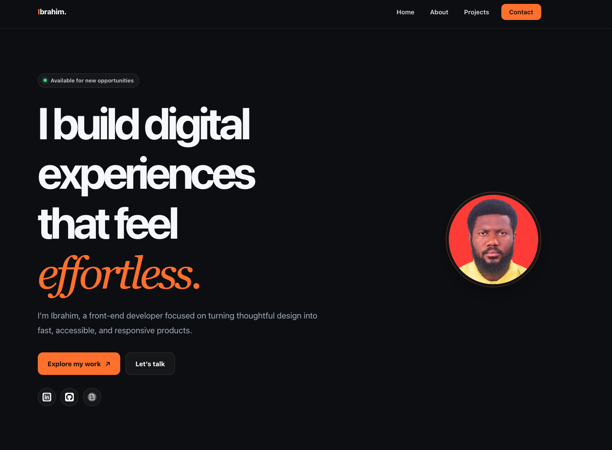

# Ibrahim Saeed — Portfolio

A responsive personal portfolio for showcasing my front-end work, technical skills, professional experience, and contact details. Built with React and Vite, with a focus on clear typography, accessibility, and a fast user experience.



## Features

- Responsive, single-page layout
- About, skills, experience, and selected-project sections
- Accessible navigation and keyboard-friendly skip link
- Contact form powered by [FormSubmit](https://formsubmit.co/)
- CV viewer that opens the embedded PDF in a new tab
- Links to GitHub and LinkedIn
- SEO metadata and structured profile data

## Built with

- [React](https://react.dev/) — component-based user interface
- [Vite](https://vite.dev/) — development server and production bundler
- CSS — responsive layouts, animations, and component styling
- [ESLint](https://eslint.org/) — code-quality checks

## Getting started

### Prerequisites

- [Node.js](https://nodejs.org/) 20.19+ or 22.12+
- npm

### Installation

```bash
git clone https://github.com/saeed240/My-Portfolio.git
cd My-Portfolio
npm install
```

Create your local environment file:

```bash
cp .env.example .env
```

Add the email address that should receive contact-form submissions:

```env
VITE_FORMSUBMIT_EMAIL=your-email@example.com
```

Then start the development server:

```bash
npm run dev
```

Open the local URL shown in the terminal, usually `http://localhost:5173`.

> The first FormSubmit submission may require email confirmation before messages are delivered.

## Available scripts

| Command | Description |
| --- | --- |
| `npm run dev` | Start the Vite development server |
| `npm run build` | Create an optimized production build in `dist/` |
| `npm run preview` | Preview the production build locally |
| `npm run lint` | Check the project with ESLint |

## Project structure

```text
.
├── public/                 # Static files and homepage preview
├── src/
│   ├── components/         # Page sections and their styles
│   │   ├── about/
│   │   ├── contact/
│   │   ├── footer/
│   │   ├── home/
│   │   ├── navbar/
│   │   └── projects/
│   ├── logos/              # Images, technology icons, and CV
│   ├── App.jsx             # Main page composition
│   ├── index.css           # Shared global styles
│   └── main.jsx            # React entry point
├── .env.example            # Contact-form configuration template
├── index.html              # Document metadata and root element
└── vite.config.js          # Vite configuration
```

## Customization

- Update profile and experience content in `src/components/about/index.jsx`.
- Edit featured work in `src/components/projects/index.jsx`.
- Replace images and the CV in `src/logos/` while keeping imports in sync.
- Adjust the color system and shared layout rules in `src/index.css`.
- Configure the contact recipient through `VITE_FORMSUBMIT_EMAIL`; do not commit your `.env` file.

## Contact

- [LinkedIn](https://linkedin.com/in/ibrahim-saeed-88783342a/)
- [GitHub](https://github.com/saeed240)
